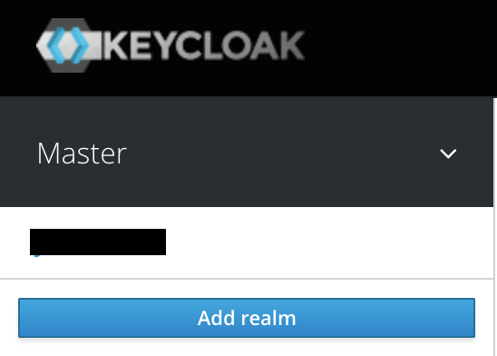
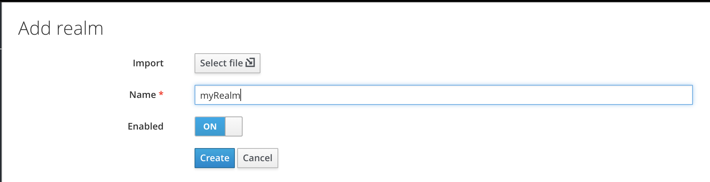

In part three of this series, we are going to look at Realm configuration. Realms in Keycloak secure and manage metadata for a set of users and clients. This allows you to set specific users or clients to realms, which gives you greater flexibility in your configuration. One might have separate realms for internal vs external clients, or for groups of users requiring high security vs external users who might not need as much security (such as forced 2FA).

Let's start out by creating a new realm, which we will use to setup our users and clients. First, click on the Add Realm button on the left side bar, like below:

Then enter a name for the Realm, for example, myRealm.

